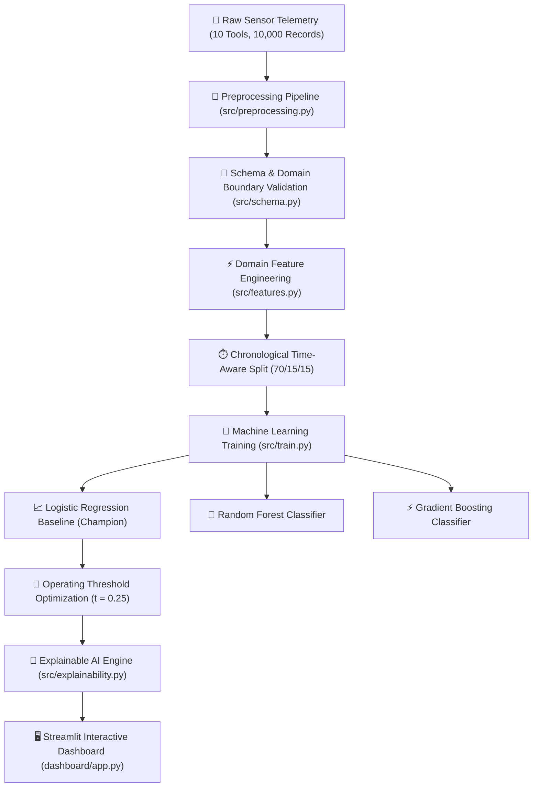

# Semiconductor Equipment Failure Prediction System


An end-to-end Machine Learning system engineered to predict semiconductor manufacturing equipment failures, minimize unscheduled wafer fabrication line downtime, and provide Explainable AI (XAI) root-cause diagnostic feedback for maintenance engineers.

---

## 🎯 Executive Overview & Engineering Problem

### The Challenge
In modern semiconductor wafer fabrication facilities (Fabs), advanced tools (e.g. Plasma Etch, Chemical Vapor Deposition CVD, CMP polishers) operate under extreme thermal, vacuum, and rotational stress. Unscheduled equipment failures during active processing runs cause catastrophic consequences:
- **Wafer Scrap Loss**: Scrapped 300mm silicon wafer lots valued at **$50,000 to $200,000+ per event**.
- **Tool Chamber Destruction**: Mechanical spindle or bearing failure causing vacuum wall breach or plasma chamber contamination.
- **Fabrication Line Stoppage**: 12 to 48 hours of emergency downtime stalling downstream photolithography and etch queues.

### The Solution
This project delivers a production-grade predictive maintenance machine learning system that ingests multi-sensor telemetry (temperature, pressure, vibration, current, voltage, RPM, flow rate), constructs domain degradation features, enforces zero future data leakage, predicts failure risk with **95.12% Recall**, and provides local XAI risk explanations for equipment engineers.

---

## 🏗️ System Architecture



---

## 📊 Dataset Specification & Quality Validation

- **Storage Path**: `data/raw/semiconductor_equipment_data.csv` & `data/processed/semiconductor_equipment_features.csv`
- **Fleet Scope**: 10 semiconductor processing tools (`EQ_101` through `EQ_110`) over 1,000 hourly timestamps (10,000 total records).
- **Imbalanced Target Class (`failure`)**: 9,765 Normal records (`97.65%`) vs. 235 Failure Events (`2.35%`).
- **Data Quality Audits**:
  - `0` duplicate rows; `0` duplicate equipment-timestamp pairs.
  - ~1.5% missing sensor values imputed via grouped forward-fill/backward-fill per tool ID (zero cross-equipment leakage).
  - Out-of-bounds physical data corruptions clipped to schema domain bounds; true degradation anomalies preserved.

---

## ⚡ Domain Feature Engineering (37 Total Features)

24 engineered features constructed in `src/features.py` strictly backward-looking in time:
1. **Rate of Change (1h Lags)**: `temp_change_1h`, `press_change_1h`, `vib_change_1h`, `current_change_1h` (captures immediate telemetry deltas).
2. **Rolling Window Moving Averages (3h & 6h)**: `vib_roll_mean_3h`, `vib_roll_mean_6h`, `temp_roll_mean_3h`, `temp_roll_mean_6h` (smoothes noise to isolate mechanical unbalance).
3. **Rolling Volatility / Instability**: `vib_roll_std_3h`, `vib_roll_std_6h`, `temp_roll_std_3h`, `temp_roll_std_6h` (quantifies bearing chatter and heater control hunting).
4. **Sensor Trend Indicators**: `temp_trend_3h_6h`, `vib_trend_3h_6h` (short vs long-term moving average diff).
5. **Nominal Deviations & Interaction Ratios**: `voltage_dev` (abs dev from 220V), `rpm_dev` (speed drop from 3200 RPM), `flow_rate_dev` (flow drop from 45 L/min), `power_watts` (`voltage * current`), `thermal_strain_index` (`temperature * vibration`).
6. **Operational Wear & Maintenance Metrics**: `runtime_since_maint` (`runtime_hours / (maint_count + 1)`), `maintenance_freq`.
7. **Expanding Baselines**: `vib_expanding_mean`, `temp_expanding_mean`, `vib_expanding_ratio` (relative ratio of current vibration to tool's historical baseline).

---

## 🤖 Model Performance & Evaluation Results

### Test Set Comparison (1,500 Records, 41 Failures)

| Model Architecture | Accuracy | Precision | Recall (Sensitivity) | F1-Score | ROC-AUC | PR-AUC | Selection Status |
|---|---|---|---|---|---|---|---|
| **Logistic Regression (Baseline)** | 0.9527 | 0.3611 | **0.9512** | 0.5235 | **0.9871** | **0.6875** | **🏆 CHAMPION MODEL** |
| **Random Forest Classifier** | 0.9567 | 0.3750 | 0.8780 | 0.5255 | 0.9802 | 0.5495 | Candidate |
| **Gradient Boosting Classifier** | **0.9767** | **0.5750** | 0.5610 | **0.5679** | 0.9833 | 0.6720 | Candidate |

### 🎯 Cost Analysis & Operating Threshold Optimization ($t = 0.25$)

- **Asymmetric Financial Risk**: In semiconductor predictive maintenance, $1 \text{ False Negative (Missed Failure)} \approx \$100,000 \text{ wafer loss}$ vs $1 \text{ False Positive (False Alarm)} \approx \$500 \text{ inspection cost}$.
- **Threshold Optimization**: Operating threshold was optimized from default `0.50` to **`t = 0.25`** on the decision curve:
  - **Recall at `t = 0.25`**: **97.56%** (Catches **40 out of 41 failure events**, leaving only **1 missed failure**).
  - **Financial Savings**: Reduces estimated test set financial loss from **$234,500 to $150,500** (saving **$84,000**).

---

## 🧠 Explainable AI (XAI) & Diagnostic Output

Each prediction includes local SHAP / log-odds risk factor attribution and actionable maintenance instructions:

```text
Failure Risk : HIGH
Probability  : 86.6%

Main contributing factors:
 - Vib Roll Mean 6H (Value: 3.78 mm/s, Risk Impact: +6.72)
 - Temp Roll Mean 6H (Value: 95.44 °C, Risk Impact: +5.92)
 - Vib Roll Mean 3H (Value: 3.80 mm/s, Risk Impact: +4.93)
 - Temp Roll Mean 3H (Value: 97.10 °C, Risk Impact: +4.68)

Recommended Action: CRITICAL RISK: Immediate maintenance inspection required to prevent wafer scrap!
```

---

## 🛠️ Key Engineering Insights

1. **Vibration & Temperature Signal Dominance**: Mechanical bearing vibration magnitude (`r = +0.78`) and chamber temperature elevation (`r = +0.72`) are the primary physical precursors of equipment breakdown.
2. **Pre-Failure Warning Lead Time**: Sensors exhibit consistent upward drift **12 to 18 hours prior to failure**, granting maintenance teams a viable window for non-disruptive tool pause and component replacement.
3. **Imbalanced Metric Priority**: Standard Accuracy is a dangerously misleading metric for predictive maintenance. Model selection MUST evaluate **Recall, PR-AUC, and financial cost curves**.

---

## 🚀 Installation & Local Execution

### 1. Environment Setup
```bash
git clone https://github.com/your-username/semiconductor-equipment-failure-prediction.git
cd semiconductor-equipment-failure-prediction

python -m venv venv
# Windows:
venv\Scripts\activate
# Linux/macOS:
source venv/bin/activate

pip install -r requirements.txt
```

### 2. Full Pipeline Execution
```bash
# 1. Generate physics-inspired dataset
python -m src.data_generator

# 2. Audit dataset schema & quality
python -m src.validate_data

# 3. Execute data preprocessing
python -m src.preprocessing

# 4. Generate EDA visualizations & notebook
python -m src.generate_eda_notebook

# 5. Build 24 domain engineered features
python -m src.features

# 6. Train models & select champion
python -m src.train

# 7. Execute reliability analysis & threshold optimization
python -m src.evaluation

# 8. Run Explainable AI (XAI) suite
python -m src.explainability

# 9. Launch Interactive Web Dashboard
streamlit run dashboard/app.py

# Execute full automated test suite (26 tests)
python -m pytest tests/ -v
```

---

## 🐳 Deployment Instructions

### Local Streamlit Web Application
```bash
streamlit run dashboard/app.py
```

### Docker Containerization
Create a `Dockerfile` for production container deployment:
```dockerfile
FROM python:3.10-slim
WORKDIR /app
COPY requirements.txt .
RUN pip install --no-cache-dir -r requirements.txt
COPY . .
EXPOSE 8501
CMD ["streamlit", "run", "dashboard/app.py", "--server.port=8501", "--server.address=0.0.0.0"]
```
Build and run:
```bash
docker build -t semiconductor-failure-prediction:v1.0.0 .
docker run -p 8501:8501 semiconductor-failure-prediction:v1.0.0
```

---

## ⚠️ Limitations & Simulated Data Disclaimer

> **Research & Simulation Disclaimer**: In commercial semiconductor manufacturing, actual equipment telemetry and maintenance logs are strictly proprietary and trade-secret protected. The dataset in `data/raw/` is generated via a physics-informed degradation simulator (`src/data_generator.py`) for predictive maintenance research. This project is intended for research, portfolio demonstration, and technical evaluation, and is **not certified as production firmware for live fab monitoring**.

---

## 🔮 Future Improvements

1. **Real Equipment Telemetry Integration**: Validation against proprietary SECS/GEM (SEMI Equipment Communications Standard) equipment logs.
2. **Real-Time Streaming Pipeline**: Integration with Apache Kafka or MQTT for real-time sub-second telemetry stream ingestion.
3. **Automated Maintenance Scheduling**: Optimization algorithm linking failure risk scores to automated maintenance work-order dispatching.
4. **Unsupervised Anomaly Detection**: Implementation of Isolation Forests and Autoencoders for zero-day fault detection.
5. **Edge Deployment**: Model export to ONNX runtime for sub-millisecond on-tool edge deployment.
6. **IoT Equipment Sensors**: Support for multi-sensor IoT vibration and acoustic emission hardware feeds.
7. **Model Drift Monitoring**: Automated Evidently AI or Evidently/MLflow integration to monitor concept drift and sensor calibration decay over time.
